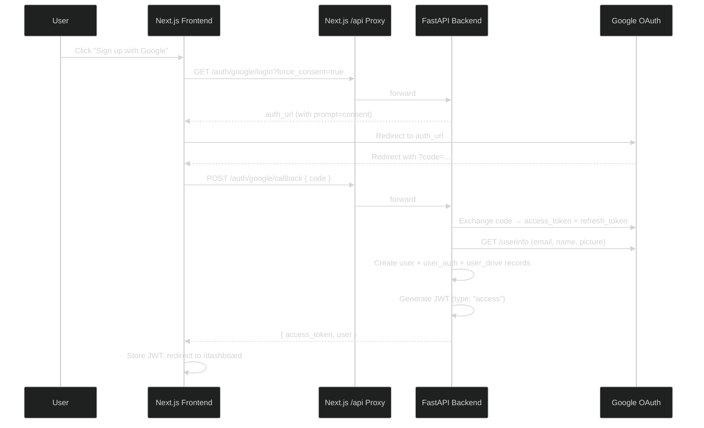
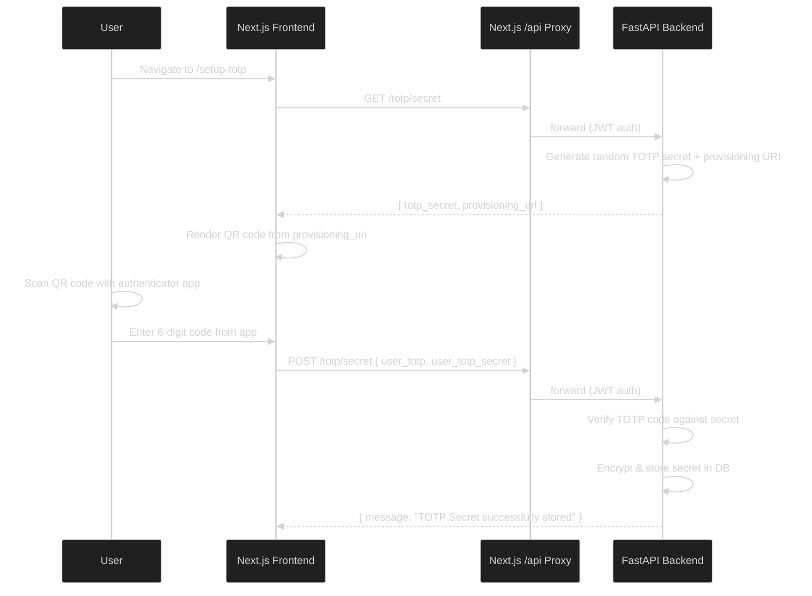
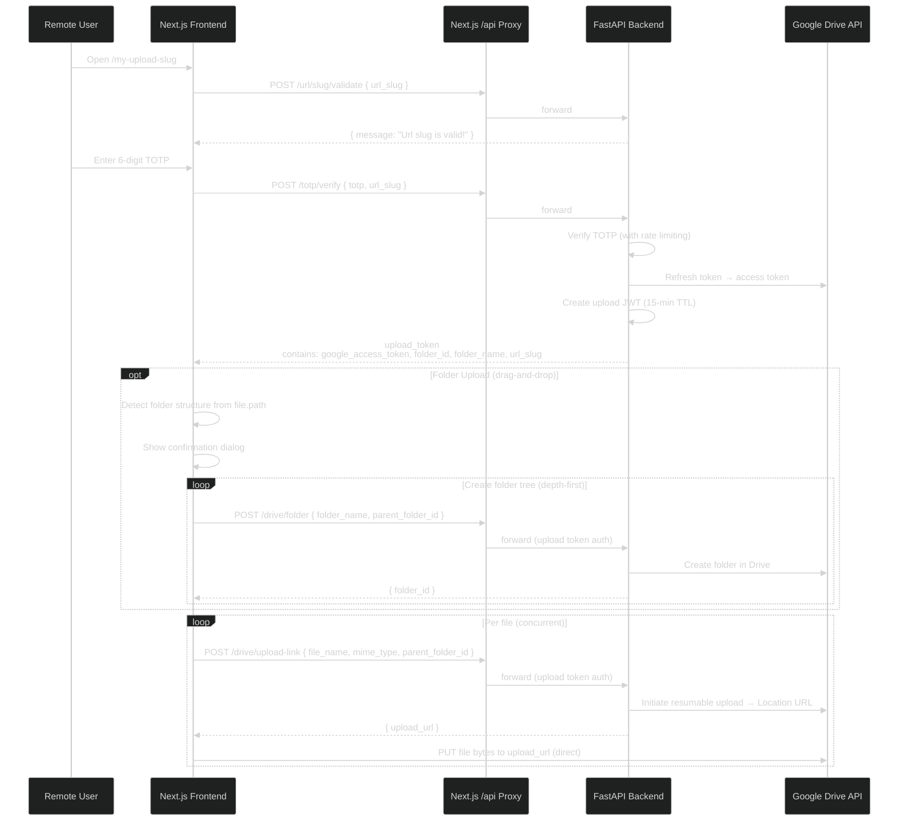
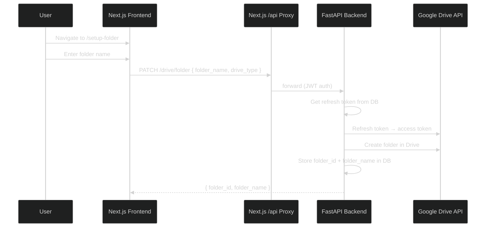
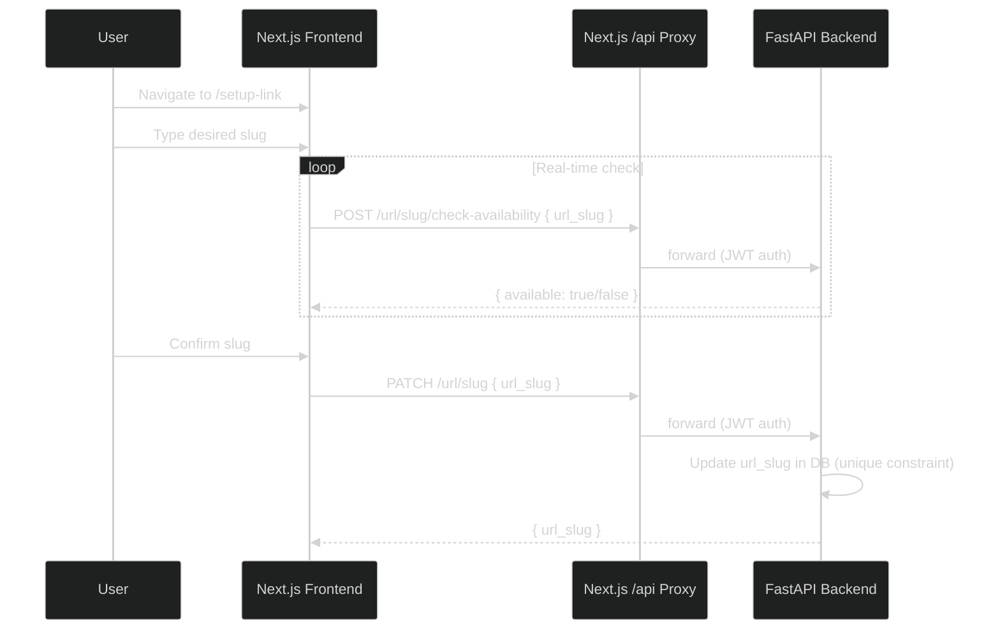

# DriveGate

A web app that lets users upload files directly to their own Google Drive, without logging in, using TOTP verification.

---

## Tech Stack

#### Frontend

* **Framework:** **Next.js**
* **Hosting:** **Vercel**
* **Network & Security:** **Cloudflare** (DNS, Email Forwarding, and Network Layer Rate Limiting)

#### Backend

* **Framework:** **FastAPI** (Python 3.11.6+)
* **ORM:** **SQLAlchemy** (Asynchronous Database Toolkit)
* **Hosting:** **Vercel Serverless Functions**
* **Availability:** **cron-job.org** (Vercel Cold-start Mitigation)

#### Database

* **Database:** **PostgreSQL** (Managed via **Aiven**)

---

## Project Structure

### Frontend: Next.js Application

| Path                              | Description                         |
| :-------------------------------- | :---------------------------------- |
| `src/app/`                      | App router pages                    |
| `src/app/[slug]/`               | Public upload page (TOTP → upload) |
| `src/app/api/[...path]/`        | Proxy route to backend API          |
| `src/app/auth/google/callback/` | OAuth callback                      |
| `src/app/dashboard/`            | User dashboard                      |
| `src/app/login/`                | Google OAuth login                  |
| `src/app/setup-totp/`           | TOTP configuration                  |
| `src/app/setup-folder/`         | Drive folder setup                  |
| `src/app/setup-link/`           | URL slug setup                      |
| `src/app/privacy/`              | Privacy policy                      |
| `src/app/terms/`                | Terms of service                    |
| `src/components/`               | Reusable UI components              |
| `src/context/`                  | React context providers (auth)      |
| `src/lib/`                      | API client utilities                |

### Backend: FastAPI Application

| Path                                     | Description                                          |
| :--------------------------------------- | :--------------------------------------------------- |
| `app/routers/auth_router.py`           | `/auth/*` — OAuth, user profile, token validation |
| `app/routers/totp_router.py`           | `/totp/*` — TOTP setup and verification           |
| `app/routers/url_slug_router.py`       | `/url/*` — URL slug management                    |
| `app/routers/drive_router.py`          | `/drive/*` — Folder creation, upload links        |
| `app/services/google_auth_service.py`  | OAuth token management                               |
| `app/services/google_drive_service.py` | Drive API operations                                 |
| `app/services/totp_service.py`         | TOTP generation/verification                         |
| `app/services/user_service.py`         | User CRUD                                            |
| `app/models/`                          | SQLAlchemy models                                    |
| `app/schemas/`                         | Pydantic request/response models                     |
| `app/core/`                            | App config and enums                                 |
| `app/database/`                        | Database connection and enums                        |
| `app/utils/jwt_manager.py`             | JWT creation/validation                              |
| `app/utils/dependencies.py`            | Route dependencies                                   |
| `app/utils/encryption.py`              | TOTP secret encryption                               |
| `app/utils/rate_limiter.py`            | TOTP brute-force protection                          |
| `testcases/`                           | API test documentation                               |

---

## Architecture Flows

### 1. Google OAuth Sign-Up Flow

First-time users sign up with Google, granting Drive permissions. This creates their account and links their Google Drive.

> **Note:** Returning users use `force_consent=false` which skips the consent screen. If a new user accidentally clicks "Sign In", they get a `409 CONFLICT` and the frontend guides them to sign up.

---

### 2. TOTP Setup Flow

After signing up, users configure TOTP to secure their upload link.

---

### 3. Upload Flow (Files & Folders)

The core flow — a remote user uploads files to the account owner's Google Drive via TOTP verification.

---

### 4. Drive Folder Setup Flow

Users configure which Google Drive folder receives uploads.

---

### 5. URL Slug Setup Flow

Users configure their custom upload URL.

---

## Schema Diagram

[Click here to view the schema diagram.](https://drawsql.app/teams/goon-squad/diagrams/schema-diagram "Drivegate Schema Diagram")

---

## Future Updates

- [ ] Add actual user CRUD
- [ ] It is possible to remove "/setup-folder" flow entirely
- [ ] Proper validation required for URL slugs and other similar stuff at all three levels (frontend, backend, database)
- [ ] Frontend code should be refactored since it has grown too much
- [ ] Add multiple accounts from same providers functionality
- [ ] **Redis Integration** — Replace in-memory caches with Redis for:

  - Rate limiter (TOTP brute-force protection)
  - Google access token cache (currently 55-min in-memory TTL)

---

## Bugs To Fix

- [ ] If a user goes to their upload URL, opens another tab, changes their upload URL, and then enters the TOTP in the tab with the old URL, it shows `Database Error: No totp_secret found for the url slug: my_slug`. This is correct behaviour but just needs graceful error handling on the frontend side. (and similar bugs)
